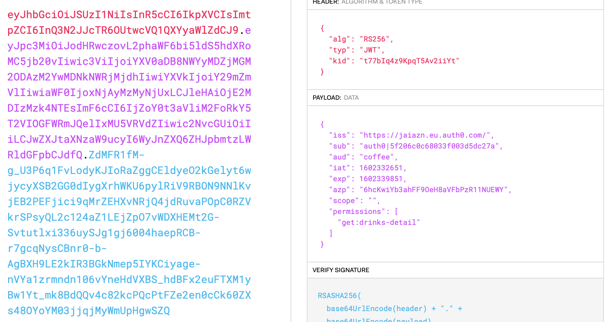
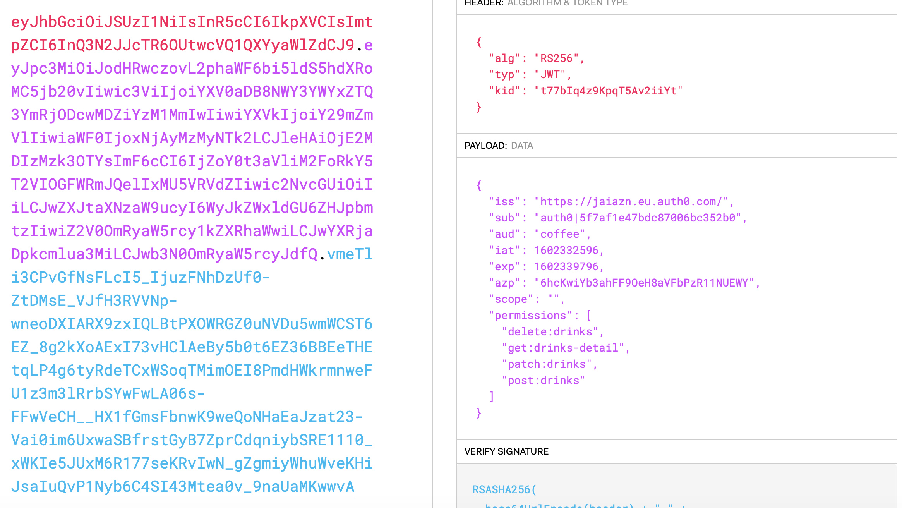
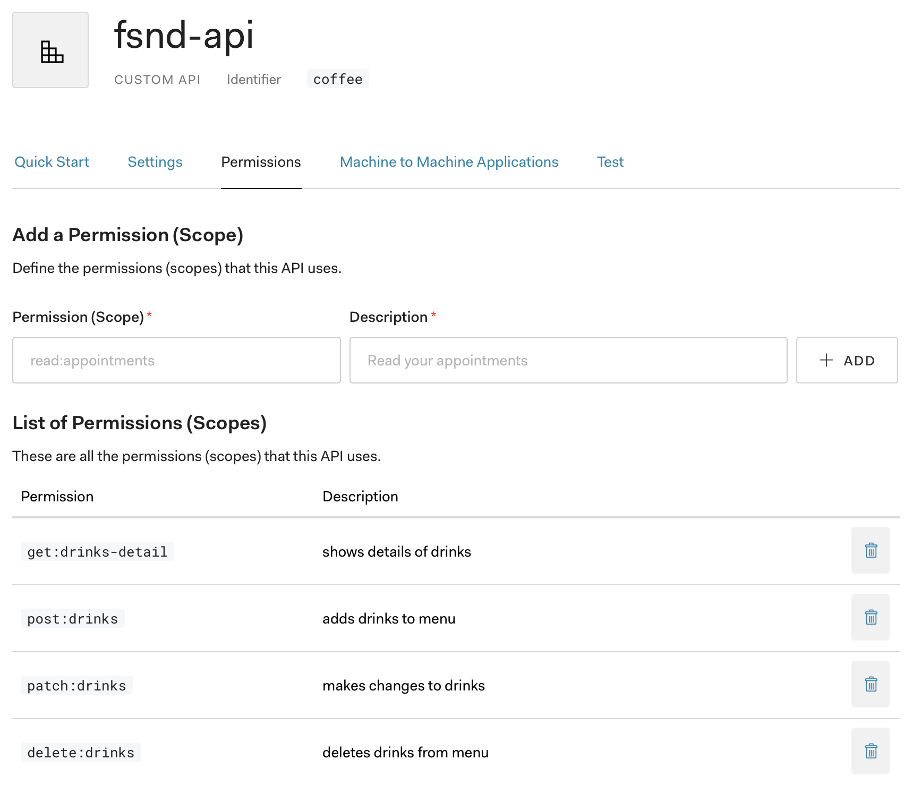
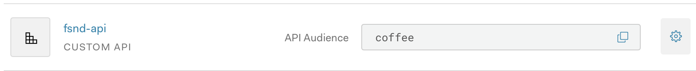
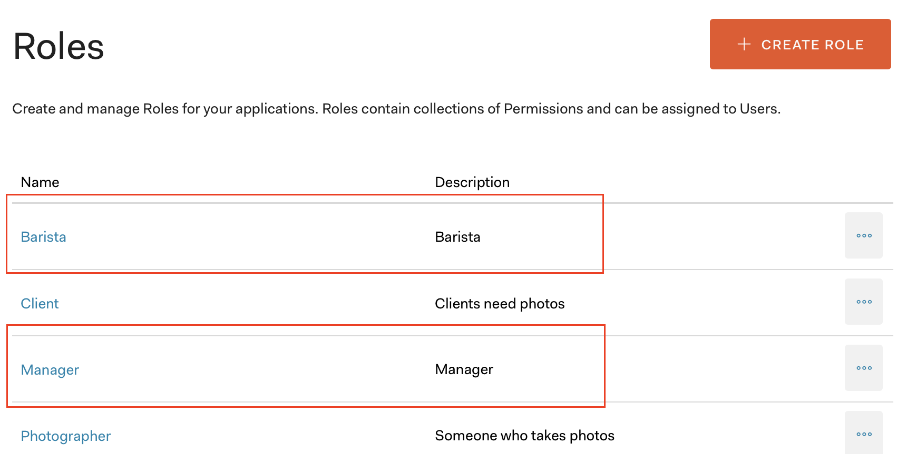

### Auth0 account

```bash
AUTH_DOMAIN = 'jaiazn.eu.auth0.com'
ALGORITHMS = ['RS256']
API_AUDIENCE = 'coffee'
```
POSTman collection updated with tokens from both **manager** and **barista**

### POSTman
* Collection with updated tokens at: ```backend/udacity-fsnd-udaspicelatte.postman_collection.json```

### POSTman test
tests in:
```backend/barista-udacity-fsnd-udaspicelatte.postman_test_run.json```

```backend/manager-udacity-fsnd-udaspicelatte.postman_test_run.json```

### Backend
* Auth functionalities added
* Endpoints and error implemented

### Frontend
* Added Auth0 variable to ```environment.ts``` file

### Working tokens




### Auth API & APP



